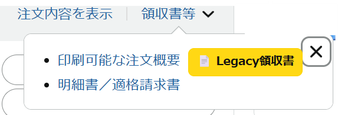

# amazon-legacy-receipt-helper-chrome

Amazonの注文履歴ページや領収書ページに **「Legacy領収書」リンク** を追加するシンプルなChrome拡張です。  
これにより、毎回URLに `/legacy/` を手動で入力しなくても、ワンクリックで「旧デザイン」の領収書ページを開けます。

---

## ✨ 機能
- Amazon注文履歴ページの各注文行に「📄 Legacy領収書」ボタンを追加
- 領収書ページを開いたときに、ページ上部に「📄 Legacy領収書を開く」ボタンを表示
- `/gp/...` のURLを自動的に `/gp/legacy/...` に変換

---

## 🚀 インストール方法
1. このリポジトリをダウンロード（または `git clone`）
2. Chromeで `chrome://extensions/` を開く
3. 右上の **デベロッパーモード** をON
4. 「パッケージ化されていない拡張機能を読み込む」→ このフォルダを選択
5. Amazonの注文履歴を開いて、商品の左上にボタンが表示されるか確認！

---

## 🛠 開発の背景
Amazonの領収書を発行するには、URLに手動で `/legacy/` を追加する必要があるケースがあります。  
参考: [mineoレポート「Amazonで領収書を発行する方法」](https://king.mineo.jp/reports/312274)  

 Legacy領収書の複数ダウンロード機能はまだサポートしていません。
 他の方のChrome拡張機能を使う方が場合によっては便利かもしれません。ご容赦ください。

 ## 使い方
 通常通り領収書を発行するボタンを押す際に、「印刷可能な注文概要」の横に「Legacy領収書」があります。  
 そのボタンをクリックすると領収書が表示されるので印刷してください。
 
 
---

## 📜 ライセンス
[MIT License](./LICENSE)

---

## 🤝 コントリビュート
Pull Request / Issue 大歓迎です！

## ⚠️ 注意事項
- 本拡張は Amazon の公式機能ではありません
- セキュリティ上の考慮は特に行っていません
- 動作や安全性について一切保証できません
- ご利用は自己責任でお願いします

